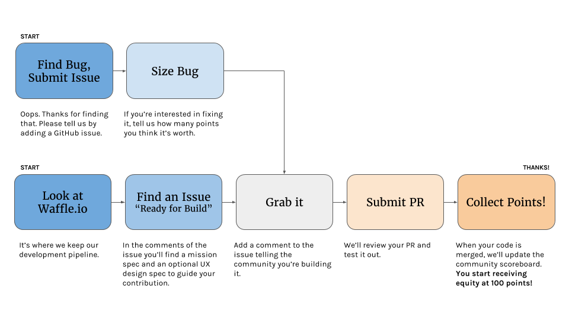
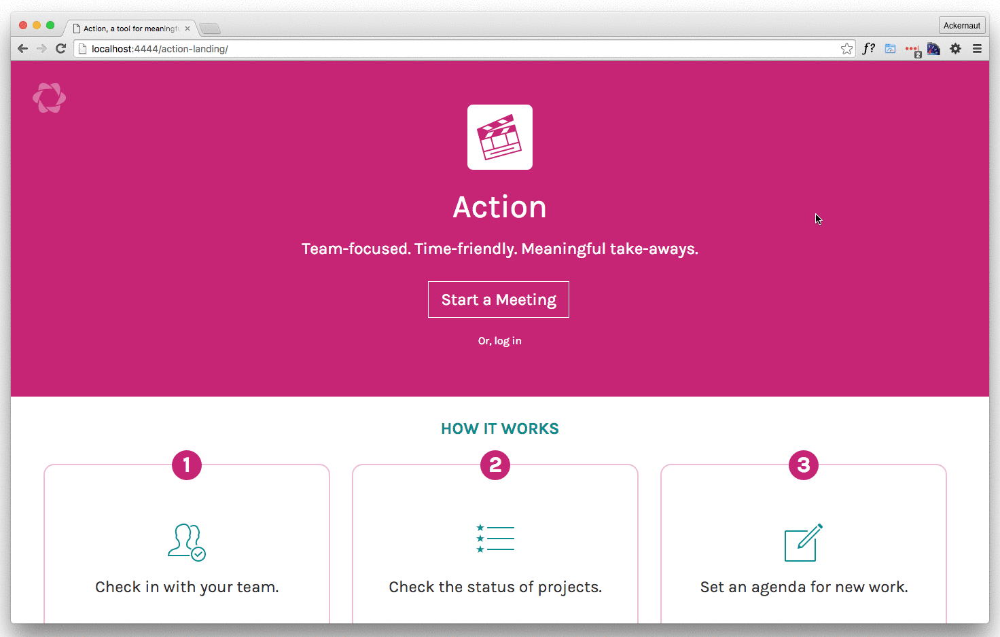

# How to contribute

Action is software built with the community for the community. At
[Parabol](http://parabol.co), we believe a significant step toward a better
workplace is to support individuals and teams to:

* Develop a clear picture of what they’re accountable for,
* Clear blockages in projects, and
* See and celebrate progress.

We’re a young organization, and we won’t be able to develop this software
and realize this vision without your help. Whether you’re a designer or a
developer, we could use a hand.

However, we also believe that contributing to Action _isn’t_ its own reward.
That’s why we’re offering equity compensation for qualifying designers
and coders who sign a [lightweight contract](https://goo.gl/MmR74i)
and contribute to Action. We were influenced by
[18F’s Open Source Micro-Purchasing model](https://18f.gsa.gov/2015/10/13/open-source-micropurchasing/).

Here’s how contributing to Action works.

# Find an Issue

All of the design and development work for Action is captured as GitHub issues.
They are tagged and arranged on our
[waffle.io board](https://waffle.io/ParabolInc/action). To see where you can
jump in, begin by having a look at the issues in the following stages:

All Issues begin in our *Backlog*. Consider these a list of things we _could_
do but aren’t actively looking to develop yet. Issues ready for contribution
appear in *Needs Design Spec* or *Ready for Build*.

## If you’re a designer

Whether its helping us to develop a new spinner or rethinking the UX of our
on-boarding flow, we could use your talent!

Here’s how to get involved:

1. [Look at Action’s waffle.io board](https://waffle.io/ParabolInc/action)
   and find an issue from the *Needs Design Spec* column.

2. Click on the issue number and read the comments. Inside you’ll find a
   link to the issue’s *mission spec* which details the work to be done.

3. If you’re interested in taking on the mission, add a comment to it and
   tell us how many points you’re interested in doing the job for
   (see: [Compensation](#compensation)). We’ll acknowledge that the issue
   now belongs to you and send you a lightweight contract to sign.

4. Once you've signed our contract, we'll move the issue to the *Designing*
   column.

5. Contribute your work along the guidelines in the mission spec. Once you’re
   done add a comment to the issue. We’ll review your hard work and provide
   feedback.

6. Once any feedback is addressed, we’ll assign you points to compensate you
   for your work, and give you our eternal thanks!

## If you’re a coder

Tired of that crusty old PHP codebase at the office? In school and wish you
could contribute to a real project? Join us!

Contributing is easy:

### If it’s an enhancement

1. [Look at Action’s waffle.io board](https://waffle.io/ParabolInc/action)
   and find an issue from the *Ready for Build* column.

2. Click on the issue number and read the comments. Inside you’ll find a
   link to the issue’s *mission spec* detailing the work and optional
   *design spec* if the work has an associated UX design.

3. If you’re interested in taking the mission, add a comment to it and
   tell us how many points you’re interested in doing the job for
   (see: [Compensation](#compensation)). We'll send you a lightweight
   contract to review and sign.

4. Once signed, we’ll acknowledge the issue now belongs to you and move
   it to the *Building* column on [Action’s waffle.io board](https://waffle.io/ParabolInc/action).

5. Create a branch named similarly to `feature-name-#issue` where `#issue`
   is the GitHub issue number (e.g. `timer-feature-#42`). This keeps our
   waffle board happy.

6. Contribute your work along the guidelines provided in the spec documents.
   Once you’re done, add a comment to the issue. We’ll review your work,
   and provide feedback.

7. Once any feedback is addressed, we’ll assign you points to compensate you
   for your work, and grant you our eternal thanks!

If you don't see an issue you're interested in, don't be discouraged. Write
your own!

### If it’s a bug

1. Submit the bug as a
   [new GitHub issue](https://github.com/ParabolInc/action/issues).

2. If you’re interested in fixing it, tell us how many points you think it’s
   worth (see: [Compensation](#compensation)).

3. Add a comment to the issue telling us that you’ve got it and we’ll
   send you a lightweight contract to review and sign.

4. Once signed, we’ll acknowledge the issue now belongs to you and move
   it to the *Building* column on
   [Action’s waffle.io board](https://waffle.io/ParabolInc/action).

5. Create a branch named similarly to `bugfix-description-#issue` where
   `#issue` is the GitHub issue number (e.g. `bugfix-authentication-#43`).

6. Submit the PR with the fix.

7. Once any feedback is addressed, we’ll assign you points to compensate you
   for your work, and grant you our eternal thanks!

# Compensation

For giving us a hand and helping the broader Action community, your
qualifying contributions may be converted into equity in Parabol Inc. Here’s
how it works:

1. When an issue is merged into the
   [Parabol Inc Action Repository](https://github.com/ParabolInc/action) by
   one of the project maintainers, we’ll tally up the points for your work.
   **Every merged issue scores 10 points + its size.**

2. We’ll add a row to the
   [Parabol Action Contributors Scoreboard](https://docs.google.com/spreadsheets/d/1V1KZJn6oKFsqrYwqr430rO3hkIkekSY7oYFzX3cVty4).
   If you’re working as a team, we’ll divide the points among you equally
   unless your team has requested an alternate
   distribution in the issue comments.

3. Once you’ve accumulated more than 100 points, we'll put an Options Grant
   proposal before our Board of Directors to convert your points to options
   in Parabol Inc. (see: [Conversion rate](#conversion-rate)) and grant
   these options to you (subject to board approval). The vesting clock
   will be backdated to the date we received a signature on the consulting
   contract for your first mission.

## Points and sizes

Before you begin working on an issue, you size it. Most issues will have a
*SWAG* sizing from one of the Action maintainers, but it’s up to you to
adjust it to what you think is fair.

|  Points  | Individual *or* team effort required |
| -------- | ------------------------------------ |
|    1     | Less than a single day               |
|    2     | One or two days                      |
|    3     | Three or four days                   |
|    5     | Five to seven days                   |
|    8     | Less than two weeks                  |
|    13    | Two to three weeks                   |
|    20    | Three to four weeks                  |
|    40    | Four to eight weeks                  |
|    100   | Too big! Let’s break it down…        |

## Conversion rate

At present, 100 points convert to options for 10,000 shares in Parabol Inc.
With 10,000,000 shares outstanding, that’s 0.1% of the company.

We currently will reevaluate this conversion rate once per calendar quarter
at our board meeting.

# Mission specs

Mission specs are brief definitions of design or engineering work. They
answer a few vital questions to frame in the work to be done, including:

  * Why is this work important?
  * Which user(s) does it serve?
  * What’s the primary journey or experience?
  * Which skills are needed to do the work?
  * How can we measure if the work is successful?
  * How many points do we think the work is worth?

The official Action mission template document can be found
[here](https://goo.gl/mB32GD).

# Design specs

Some GitHub issues require a design spec in addition to a mission spec.
Design specs are needed when a particular mission is complicated enough
that a more in-depth written description, series of diagrams, or prototype is
necessary to communicate intent.

There are no specific requirements for how to create a design, but some
examples we like are:

   * UI/UX
     * A series of still images depicting the primary journey
     * A clickable prototype, constructed in a tool such as
       [InVision](http://www.invisionapp.com/)
     * A coded front-end prototype, perhaps branched directly from the
       Action source repository
     * A screencast with talking track
     * Or even an animated gif, like so:

    

Simply attach your design spec to the GitHub issue and we’ll give you
feedback.

# Community

Want to collaborate? Join us on our Slack community!

Sign up at http://slackin.parabol.co/.

## Questions

If you’ve got questions you'd like to inquire about privately, please don’t
hesitate to reach out. You can reach us at
[love@parabol.co](mailto:love@parabol.co).
