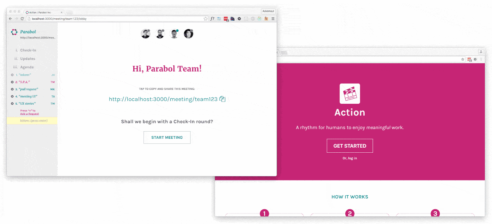

# Action

[](http://slackin.parabol.co/)
[](https://circleci.com/gh/ParabolInc/action)

## Overview

An open-source tool for meaningful meetings to build smarter, more
agile teams.



From [Parabol, Inc](http://parabol.co).

Curious what this is all about? Each week we publish a distillation of our
progress, news, and information in
[Parabol Focus](https://medium.com/parabol-focus).

Live demo: http://action-staging.parabol.co/

### Quick Links

* [Stack Information](#stack-information)
* [Setup](#setup)
* [Getting Involved](#getting-involved)
* [Releases](#releases)
* [About](#about)
* [License](#license)

## Stack Information

Action is a Node.js application based upon the
[Meatier](https://github.com/mattkrick/meatier) stack:

| Concern            | Solution                                                  |
|--------------------|-----------------------------------------------------------|
| Server             | [Node 6](https://nodejs.org/)                             |
| Server Framework   | [Express](http://expressjs.com/)                          |
| Database           | [RethinkDB](https://www.rethinkdb.com/)                   |
| Data Transport     | [GraphQL](https://github.com/graphql/graphql-js)          |
| Sockets            | [socketcluster](http://socketcluster.io/)                 |
| Client State       | [Redux](http://redux.js.org/)                             |
| Front-end          | [React](https://facebook.github.io/react/)                |
| Styling            | [react-look](https://github.com/rofrischmann/react-look/) |

## Setup

### Installation

#### Prerequisites

Action requires Node.js >=5.10.1 (we're using 6.2.0 in development).
We recommend using [n](https://github.com/tj/n) to install and manage your
node versions.

Action also depends on [RethinkDB](https://rethinkdb.com/). Make sure
you have it installed. If you have OSX, we recommend homebrew so
upgrades are as easy as `brew update && brew upgrade rethinkdb`

#### Source code

```bash
$ git clone https://github.com/ParabolInc/action.git
$ cd action
$ rethinkdb # in a separate window
$ npm install
$ npm run quickstart
```
_Remember: if RethinkDB is running locally, you can reach its dashboard at
[http://localhost:8080](http://localhost:8080) by default._

### Client-side development

In this mode, webpack will hot swap your updated client modules without
restarting the server.
```bash
$ npm run dev
```
[http://localhost:3000/](http://localhost:3000/)

### Server-side development

In this mode, the server will build client bundle and start a production
server with the fresh code.
```bash
$ npm run bs
```
[http://localhost:3000/](http://localhost:3000/)

### Database development
Database schema version is managed by
[rethink-migrate](https://github.com/JohanObrink/rethink-migrate). These
migrations are stored in `./src/server/database/migrations`.

If you make changes to the Action schema, make certain to create a new
migration.

## Bringing your database up to date

```bash
$ npm run db:migrate
```

## Migrating backward and forward

The following commands are available to migrate your database instance
forward and backward in time:

   * `npm run db:migrate-up` - migrate up one schema version
   * `npm run db:migrate-up-all` - migrate upward to latest schema
   * `npm run db:migrate-down` - migrate down one schema version
   * `npm run db:migrate-down-all` - migrate downward completely (will erase everything)

## Exploring the data API:

While running the app in development mode, navigate to
http://localhost:3000/graphql for testing out new queries/mutations

## Exploring component design:

We've begun assembling a pattern library of all of the components we've created
for the app. Too see them, navigate to http://localhost:3000/patterns

## Getting Involved

Action is software built with the community for the community. We can't do
it without your help!

Our [Action waffle.io Board](https://waffle.io/ParabolInc/action) organizes
available design and development missions. Check it out, grab a mission
(or contribute your own) and we'll gladly (and thankfully!) merge your pull
request.

You're contribution won't go unrewarded: Parabol offers equity in our
young company for qualified contributions to Action.

See [CONTRIBUTING.md](./CONTRIBUTING.md) for more information on how to
get involved and how to get compensated.

## Releases

| Release | Summary                                    |
|---------|--------------------------------------------|
| v0.4.1  | Added Me Dash., multiplayer editing states |
| v0.4.0  | Add Lobby, Check-in, start of Team Dash.   |
| v0.3.0  | Add Welcome journey, redux-storage         |
| v0.2.0  | Add first pass at team creation/invitation |
| v0.1.0  | Things got a whole lot meatier             |
| v0.0.1  | Developer preview and archtecture demo     |

## About

Authored and maintained by [Parabol](http://parabol.co).

### Parabol Core Team

* [jordanh](https://github.com/jordanh)
* [ackernaut](https://github.com/ackernaut)
* [mattkrick](https://github.com/mattkrick)

### License

Copyright 2016 Parabol, Inc.

Licensed under the GNU AFFERO GENERAL PUBLIC LICENSE, Version 3.0 (the
"License"); you may not use this software except in compliance with the
License.  You may obtain a copy of the License at

    https://www.gnu.org/licenses/agpl-3.0.en.html

Unless required by applicable law or agreed to in writing, software
distributed under the License is distributed on an "AS IS" BASIS,
WITHOUT WARRANTIES OR CONDITIONS OF ANY KIND, either express or implied.
See the License for the specific language governing permissions and
limitations under the License.
