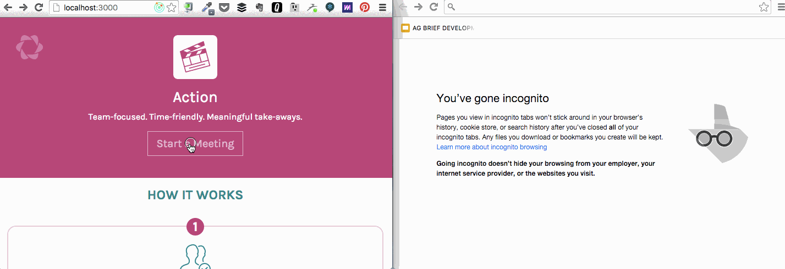

# Action

## Overview

An open-source tool for meaningful meetings to build smarter, more
agile teams.



From [Parabol, Inc](http://parabol.co).

### Quick Links

* [Stack Information](#stack-information)
* [Setup](#setup)
  * [Installation](#installation)
    * [Prerequisites](#prerequisites)
    * [Source-code](#source-code)
  * [Running in Development](#running-in-development)
  * [Production](#running-in-development)
* [Getting Involved](#getting-involved)
* [Releases](#releases)
* [About](#about)
  * [Parabol Core Team](#parabol-core-team)
* [License](#license)

## Stack Information

Action is a Node.js application based upon the excellent and
ever-evolving [react-redux-universal-hot-example](https://github.com/erikras/react-redux-universal-hot-example)
boilerplate.

| Concern            | Solution                                     |
|--------------------|----------------------------------------------|
| Server             | [Node 5](https://nodejs.org/)                |
| Server Framework   | [Express](http://expressjs.com/)             |
| Database           | [RethinkDB](https://www.rethinkdb.com/)      |
| ORM                | [Thinky](http://thinky.io/)                  |
| Model API          | [Falcor](https://netflix.github.io/falcor/)  |
| Change Publishing  | [socket.io](http://socket.io/)               |
| Client State       | [Redux](http://redux.js.org/)                |
| Front-end          | [React](https://facebook.github.io/react/)   |
## Setup

### Installation

#### Prerequisites

Action requires Node.js and >4.1.1 (we're using 5.3.0 in development).
[Go here](https://nodejs.org/) to install a version for your system.

Action also depends upon have an instance of
[RethinkDB](https://rethinkdb.com/). Make sure you have it installed.

#### Source-code

```bash
$ git clone https://github.com/ParabolInc/action.git action
$ cd action
$ npm install
```

### Running in Development

1) In one terminal window, start RethinkDB (if it's not running already):

```bash
$ rethinkdb
```

_Remember: if RethinkDB is running locally, you can reach its dashboard at
[http://localhost:8080](http://localhost:8080) by default._

2) Start Action in development mode:

```bash
$ npm run dev
```

The application ready when you see the message `webpack built (pack) in
(time)`.

3) Open a browser and visit [http://localhost:3000/](http://localhost:3000/)

### Production

Information for running Action in a production environment is coming soon.
If you're forging out on your own, have a look in `config/` and
`config/env/production.js` to see which configuration is available.

## Getting Involved

We track our development missions on the
[https://waffle.io/ParabolInc/action](Action waffle.io Board). Check it
out, grab a mission (or contribute your own) and we'll gladly (and thankfully)
merge your pull request.

## Releases

UNRELEASED - Nothing to share here yet ;)

## About

Authored and maintained by [Parabol](http://parabol.co).

### Parabol Core Team

* [jordanh](https://github.com/jordanh)
* [jrwells](https://github.com/jrwells)
* [ackernaut](https://github.com/ackernaut)

### License

Copyright 2016 Parabol, Inc.

Licensed under the Apache License, Version 2.0 (the "License");
you may not use this file except in compliance with the License.
You may obtain a copy of the License at

    http://www.apache.org/licenses/LICENSE-2.0

Unless required by applicable law or agreed to in writing, software
distributed under the License is distributed on an "AS IS" BASIS,
WITHOUT WARRANTIES OR CONDITIONS OF ANY KIND, either express or implied.
See the License for the specific language governing permissions and
limitations under the License.
