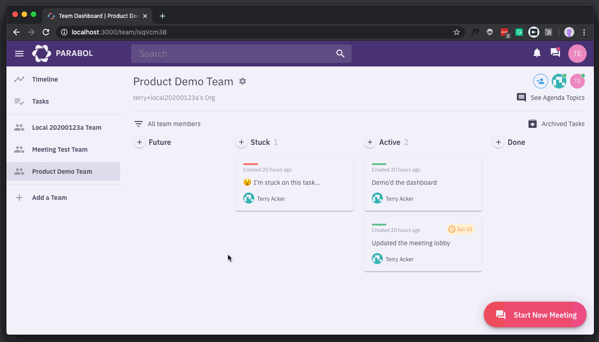
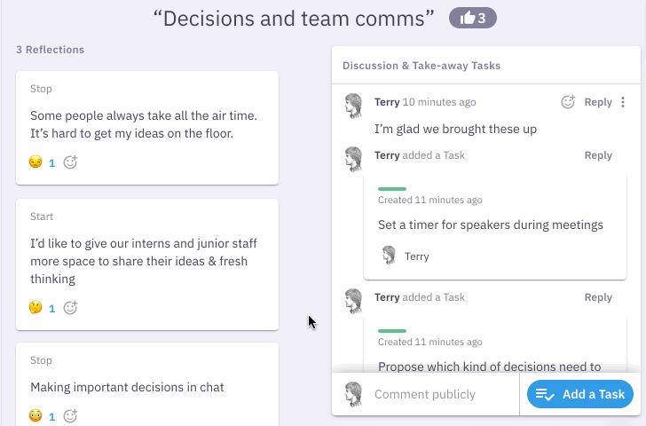

# Parabol - We're [hiring](https://www.parabol.co/join)!

[](https://slackin.parabol.co/)
[](https://circleci.com/gh/ParabolInc/parabol)

## Overview

[Parabol](https://www.parabol.co) is an open-source application for running
agile meetings such as team retrospectives or Sprint Poker™. You may try
a single-player demo of Parabol (no login creation required) at: https://parabol.co/retro-demo

We endeavor to be a
transparent organization and publish
our company's [history and SaaS metrics](https://www.parabol.co/blog/tag/friday-ship).




## Stack Information

| Concern                | Solution                                                        |
| ---------------------- | --------------------------------------------------------------- |
| Server                 | [Node](https://nodejs.org/)                                     |
| Server Framework       | [μWebSockets.js](https://github.com/uNetworking/uWebSockets.js) |
| Database (Legacy)      | [RethinkDB](https://www.rethinkdb.com/)                         |
| Database               | [PostgreSQL](https://www.postgresql.org/)                       |
| PubSub & Cache         | [Redis](https://redis.io)                                       |
| Data Transport         | [GraphQL](https://github.com/graphql/graphql-js)                |
| Real-time Connectivity | [trebuchet](https://github.com/mattkrick/trebuchet-client)      |
| Client Cache           | [Relay](https://facebook.github.io/relay/)                      |
| UI Framework           | [React](https://facebook.github.io/react/)                      |
| Styling                | [Emotion](https://emotion.sh/)                                  |

## Setup

### Prerequisites

- [Node](https://nodejs.org/en/download/)
- [Yarn](https://classic.yarnpkg.com/en/docs/cli/install/)
- [Docker Compose](https://docs.docker.com/compose/install/)
- [Watchman](https://facebook.github.io/watchman/docs/install.html) (Development only)

### Installation

```bash
$ git clone https://github.com/ParabolInc/parabol.git
$ cd parabol
$ cp .env.example .env # Add your own vars here
$ yarn
$ yarn db:start
$ yarn dev
```

- By default, the app will run at: http://localhost:3000/

- If `yarn db:start` failed and `localhost:5050` isn't working, a docker
  container, volume, or image may be corrupted and need to be pruned.

### Development

- [Code Reviews](./docs/codeReview.md)
- [Create new GraphQL Mutations](./scripts/codeshift/README.md)
- [Docker](./docker/README.md)
- [Dev.js](./scripts/README.md)
- [File Storage (CDN, Local, S3)](./packages/server/fileStorage/README.md)
- [GraphiQL, Private Schema Admin](./packages/server/graphql/private/README.md)
- [GraphQL Executor](./packages/gql-executor/README.md)
- [Integrations (GitHub, Jira, Slack, etc.)](./docs/integrations.md)
- [PostgreSQL](./packages/server/postgres/README.md)
- [RethinkDB](./packages/server/database/README.md)
- [Shared Scripts](./packages/client/shared/README.md)
- [VS Code Tips](.vscode/tips.md)

### Deploy

```bash
$ yarn && yarn build && yarn start
```

- [How to Ship](./docs/deployment.md)

## Getting Involved

Parabol offers equity for qualified contributions.

See [CONTRIBUTING.md](./CONTRIBUTING.md) for more information on how to
get involved and how to get compensated.

## Have feedback, ideas or feature requests?

Please review our [Discussions](https://github.com/ParabolInc/parabol/discussions) to see if there's already a similar suggestion, and if not please feel free to [start a new one](https://github.com/ParabolInc/parabol/discussions/new).

## Releases

For details on all releases, refer to [CHANGELOG.md](./CHANGELOG.md).

## Parabol Core Team

- [jordanh](https://github.com/jordanh)
- [ackernaut](https://github.com/ackernaut)
- [mattkrick](https://github.com/mattkrick)

## License

Copyright (c) 2016-present, Parabol, Inc.

This codebase is dual-licensed under the GNU AFFERO GENERAL PUBLIC LICENSE,
Version 3.0 while holding, at Parabol's sole discretion, the right to create
new licenses. For details please read [LICENSE](LICENSE).
