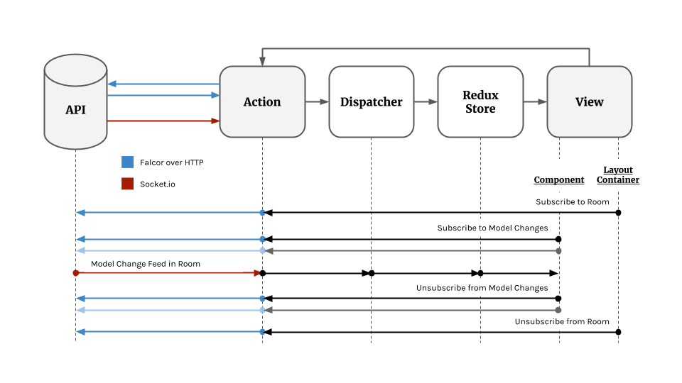

# Action Data Path

Action is being architected for reactivity and realtime collaboration.

We use a hybrid approach for collaboration and updates: receiving initial
values and publishing model changes are performed using
[Falcor](http://netflix.github.io/falcor/). However, subscribed Model
change events are received over a [socket.io](http://socket.io) connection.

Generating model changes relies heavily on
[RethinkDB's](https://www.rethinkdb.com/)
[changefeed feature](https://rethinkdb.com/docs/changefeeds/javascript/),
[socket.io rooms](http://socket.io/docs/rooms-and-namespaces/), and
proprietary logic (see: `api/models/helpers/subscriptions.js` and
`api/socketio/publish.js`) for gluing the two together.

## Detail

The render and data paths are closely coupled. Here's how it works:

### 1. Initial URL Request & Server-side Render

The Express framework handles routing the initial request in `src/server.js`.
If the request is for a route handled by our single-page application
(see: `src/routes.js`), the server will perform a server-side render.

During the server-side render a
[redux store](http://rackt.org/redux/docs/api/Store.html) will be created
and the components will be rendered along the hierarchy defined by the
redux router within `src/routes.js` - starting with `App`
(see: `src/containers/App/app.js`).

For components that use the `@connectData` helper (see:
`src/helpers/connectData.js`) and specify a `fetchData()` method, the data
for the component will be fetched _on the server_ by propagating redux
actions and ultimately transforming the redux store.

When all components have fetched their data, the redux store will be
serialized and the initial page served to the client.

### Client-side Render, Subscriptions, & Model Updates

On the client, any components using `@connectData` will call their
`fetchDataDeferred()` method.

In Action, a convention is followed where the container component just
under `App` is called the _layout_ (for example, `LandingLayout`). A layout
has a RESTful URL. When the component is mounted, it will propagate an action
to subscribe the layout to a socket.io room managed by the API.

For a child component to subscribe to a model change, it will propagate
redux actions which will call subscription methods on the Falcor model.
However, the actual changes will be received within the socket.io room.

A singleton named `SocketManager` receives these model updates from the
API server as a stream of socket.io `publish` event within the room. The
`SocketManager` looks up which redux actions must be dispatched in response
to the `publish` event. Redux reducers listening for these actions transform
the state and the React components re-render themselves.

When the user interacts with the components, they will invoke action handlers
which will modify the Falcor model. When possible, local redux state
transitions are performed optimistically.

## Future Directions

### Falcor Maturity

[Netflix Falcor](http://netflix.github.io/falcor/) is a fairly new
technology. It was architected from edge to edge to use Javascript
[Observable](https://github.com/Reactive-Extensions/RxJS) objects. At the
moment, [Falcor does not support real-time updates](https://github.com/Netflix/falcor/issues/425). When this should
change, we'll consider re-archecting our application to use a single
strategy for handling model updates.

### Scaling notes

RethinkDB scales horizontally. However, in the case where two socket.io
clients are attached to two different API servers,
[Redis](http://socket.io/docs/using-multiple-nodes/) will need to be
introduced in order to
[knit the socket.io rooms together](http://socket.io/docs/using-multiple-nodes/).

### Beyond Last-Write-Wins

A last-write-wins architecture is fairly simple to comprehend and scale.
However there are some known drawbacks:

  * Corner-cases that emerge over lossy links

  * Unable to easily handle offline synchronization

  * The need to discretize all changes on a larger document, i.e. no
    automatic generation of small change sets and merging of conflicts

[Operational Transforms](http://operational-transformation.github.io/), a
synchronization methodology pioneered in Google Wave and used in Google Docs
illuminated the path forward. Since Google Docs, a variety of other
synchronization techniques have emerged to build "Occasionally Consistent"
applications. Other options on our radar include:

  * [SwarmJS](https://github.com/gritzko/swarm)
  * [diffsync](https://github.com/janmonschke/diffsync)
  * [pouch-websocket-sync](https://github.com/pgte/pouch-websocket-sync#readme)
