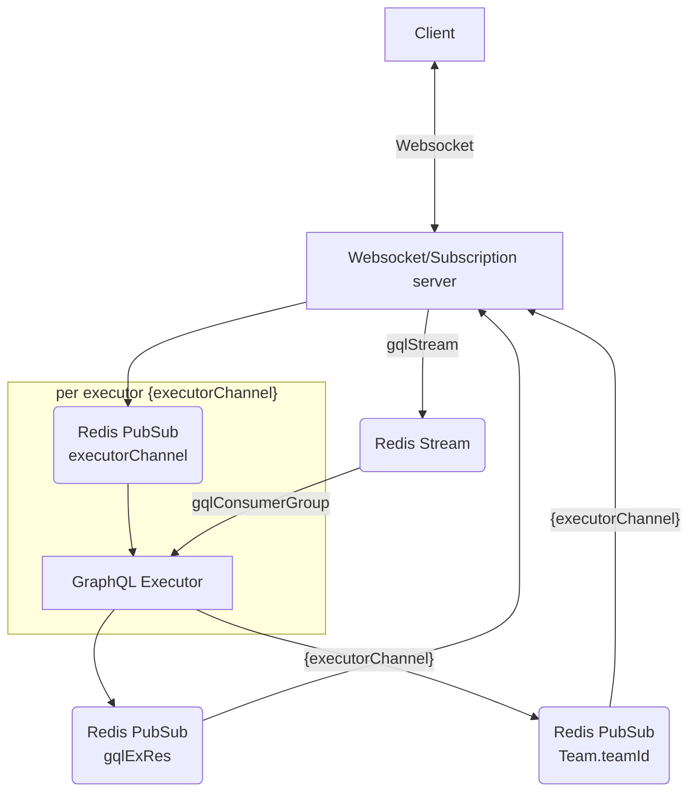
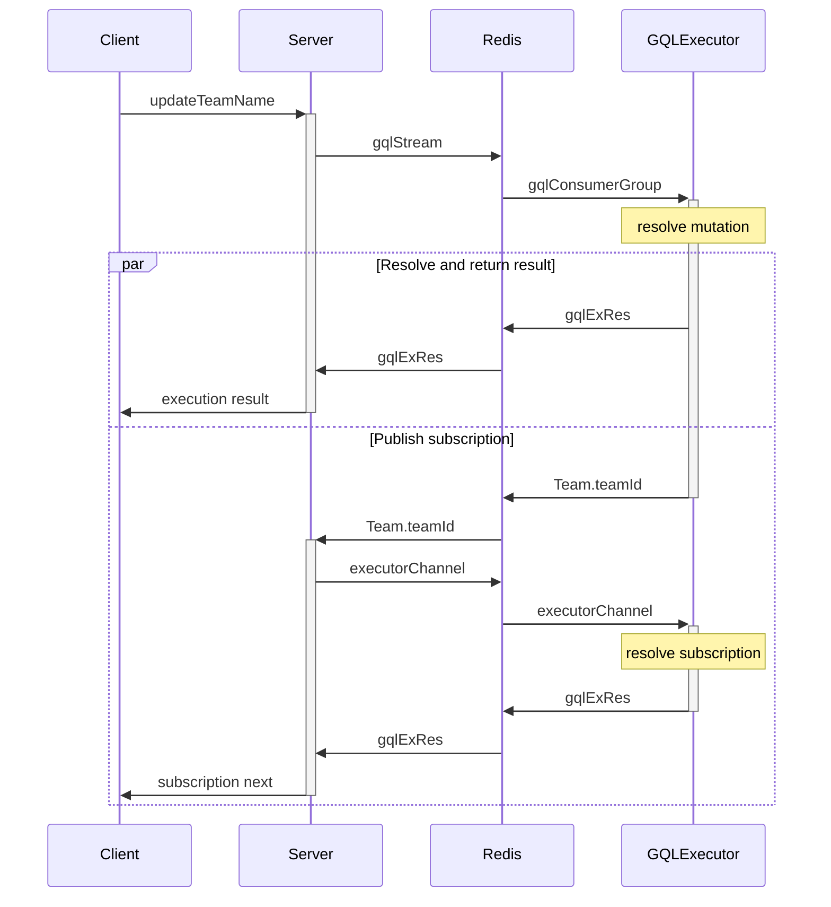

# Service architecture

Overview how the different services interact with each other.

## Flow

Data flow for a GraphQL request which also publishes subscription data.

## Sequence

Example sequence of a mutation `updateTeamName`.

