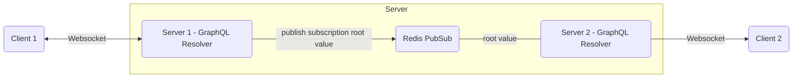
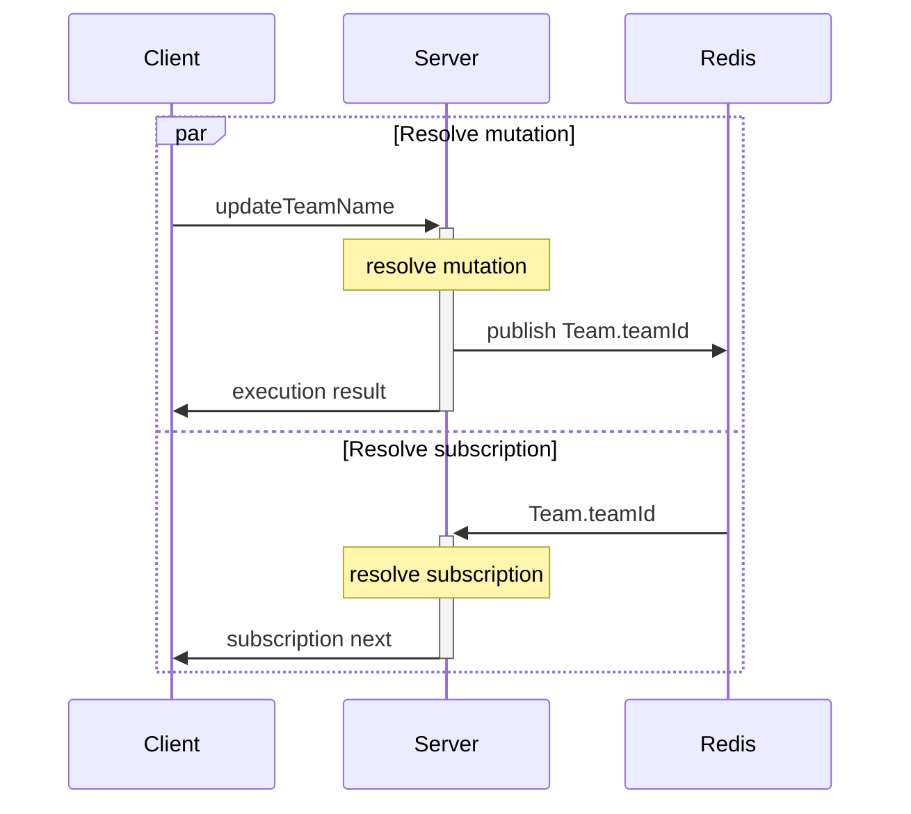

# Service architecture

Overview how the different services interact with each other.

## Flow

Data flow for a GraphQL mutation by Client 1 which also publishes subscription data to Client 2.
The example shows a deployment with 2 servers.

## Sequence

Example sequence of a mutation `updateTeamName`.

